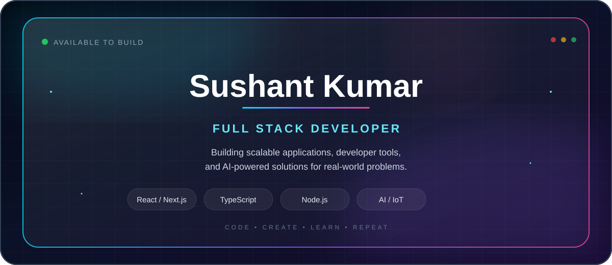

<p align="center">
  
</p>

---

<!-- ========================= HERO ========================= -->

<!-- <table width="100%" cellspacing="0" cellpadding="0">
<tr> -->

<!-- ================= LEFT SIDE ================= -->

<!-- <td width="48%" valign="middle"> -->

<!-- Animated Name Banner -->

<!-- 
<h2 style="margin-top: 5px;">Full Stack Developer</h2>
<p>
Building software that solves real-world problems through
creativity, engineering, and continuous learning.
</p>

<br>

<p>
☕ <b>Java</b>
&nbsp; • &nbsp;
⚛️ <b>React</b>
&nbsp; • &nbsp;
🌱 <b>Spring Boot</b>
</p>

<p>
🤖 <b>AI & IoT</b>
&nbsp; • &nbsp;
🤝 <b>Open Source</b>
</p>

</td> -->

<!-- ================= RIGHT SIDE ================= -->

<!-- <td width="60%" align="center" valign="middle">


</td>

</tr>
</table> -->

<!-- ======================= END HERO ======================= -->

# 👋 About Me

I'm a **Computer Science Engineering student** focused on building practical software solutions and continuously improving my engineering skills.

My interests include **Full Stack Development, Java, Open Source, Artificial Intelligence, IoT, and Cloud technologies**.

I enjoy taking an idea, breaking it into smaller problems, and turning it into a working project.

```text
Focus       → Full Stack Development
Primary     → Java
Exploring   → Spring Boot • Cloud • AI • IoT
Community   → Open Source
Mindset     → Learn • Build • Contribute • Improve
```

---

# 💼 Professional Summary

- 🎓 Computer Science Engineering student
- 💻 Interested in Full Stack & Backend Development
- ☕ Building strong foundations in Java
- 🌐 Developing modern web applications
- 🤝 Contributing to Open Source
- 🤖 Exploring AI and IoT-based solutions
- ☁️ Learning Cloud & DevOps technologies
- 🎯 Working toward becoming a Software Engineer

---

# 🛠️ Tech Stack
<table>
<tr>

<!-- ======================= LEFT COLUMN ======================= -->

<td width="52%" valign="top">

## 💻 Languages

<table>
<tr>
<td align="center">
<br>
Python
</td>

<td align="center">
<br>
JavaScript
</td>

<td align="center">
<br>
TypeScript
</td>

<td align="center">
<br>
Java
</td>

<td align="center">
<br>
C++
</td>
</tr>
</table>

## 🎨 Frontend

<table>
<tr>
<td align="center">
<br>
HTML
</td>

<td align="center">
<br>
CSS
</td>

<td align="center">
<br>
React
</td>

<td align="center">
<br>
Vite
</td>

<td align="center">
<br>
Vue
</td>
</tr>
</table>

## ⚙️ Backend

<table>
<tr>
<td align="center">
<br>
Node.js
</td>

<td align="center">
<br>
Spring Boot
</td>

<td align="center">
<br>
Express.js
</td>

<td align="center">
<br>
Redis
</td>

</tr>
</table>

## 🗄️ Database & Cloud

<table>
<tr>
<td align="center">
<br>
MySQL
</td>

<td align="center">
<br>
PostgreSQL
</td>

<td align="center">
<br>
MongoDB
</td>

<td align="center">
<br>
Firebase
</td>

<td align="center">
<br>
Supabase
</td>
</tr>
</table>

## 🔧 Tools & Platforms

<table>
<tr>
<td align="center">
<br>
Git
</td>

<td align="center">
<br>
GitHub
</td>

<td align="center">
<br>
Docker
</td>

<td align="center">
<br>
Postman
</td>
</tr>

<tr>
<td align="center">
<br>
VS Code
</td>

<td align="center">
<br>
Figma
</td>

<td align="center">
<br>
Canva
</td>

<td align="center">
<br>
Linux
</td>
</tr>
</table>


<!-- ======================= RIGHT COLUMN ======================= -->

<td width="48%" valign="top">

## 🌱 Currently Learning

<p align="center">
  
</p>

<p align="center">
  
</p>

<p align="center">
  
</p>

---

## 📊 GitHub Activity

<p align="center">
  
</p>

<p align="center">
  
</p>

---

## 🤝 Connect With Me

<p align="center">

<a href="twitter">
  
</a>

<a href="https://linkedin.com/in/sushantkumar6">
  
</a>

<a href="https://leetcode.com/u/Kumar-Sushant/">
  
</a>

<a href="https://discordapp.com/users/757179877576146945">
  
</a>

</p>

<p align="center">

<a href="portfolio">
  
</a>

<a href="Resume">
  
</a>

</p>

---

<p align="center">
  <i>Building things that solve problems.</i>
</p>

<p align="center">
  ⭐ Thanks for visiting my profile!
</p>
